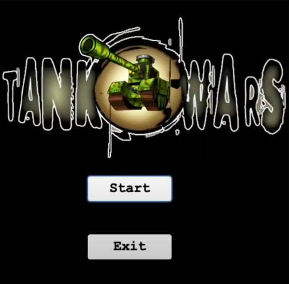

# TankGame

## Project Overview

The first program is the Tank Wars Game, it has 2 players that they can able to fight each other
when they fire their bullets. Also, there are breakable and unbreakable walls around the tank map
game and pick up weapons and tank’s health recovery. It has split screen, mini map, and the
health and lives for 2 player tanks.

## Technical Overview

In this Tank Wars Game project, the tank, bullet, walls, and power ups are objects and they have
their own functionalities. There are multiple abstract classes and child classes to organize entities
for the Tank Wars Game. Some Objects are categorized and organized by the abstract classes such
as Moveable and Stationary. The Game Objects class is responsible to handle all the categories
abstract classes and required objects for the game.

### Start Panel

### Preview 1 

### Preview 2 

### End Panel

